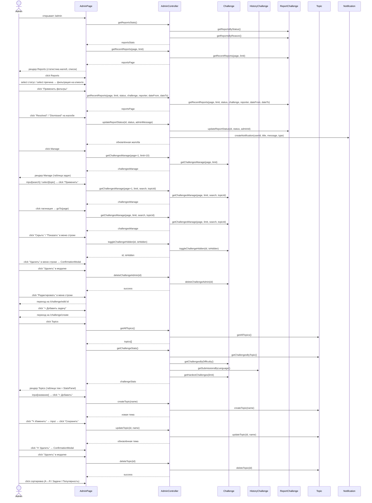

# Диаграмма последовательности — Admin Page

```mermaid
sequenceDiagram
    actor Admin
    participant Page as AdminPage
    participant AC as AdminController
    participant Challenge
    participant HC as HistoryChallenge
    participant RC as ReportChallenge
    participant Topic
    participant Notification

    Admin->>Page: открывает /admin

    Page->>AC: getReportsStats()
    AC->>RC: getReportsByStatus()
    AC->>RC: getReportsByReason()
    AC-->>Page: reportsStats

    Page->>AC: getRecentReports(page, limit)
    AC->>RC: getRecentReports(page, limit)
    AC-->>Page: reportsPage

    Page-->>Admin: рендер Reports (статистика жалоб, список)

    Admin->>Page: click Reports

    Admin->>Page: select статус / select причина → фильтрация на клиенте

    Admin->>Page: click "Применить фильтры"
    Page->>AC: getRecentReports(page, limit, status, challenge, reporter, dateFrom, dateTo)
    AC->>RC: getRecentReports(page, limit, status, challenge, reporter, dateFrom, dateTo)
    AC-->>Page: reportsPage

    Admin->>Page: click "Resolved" / "Dismissed" на жалобе
    Page->>AC: updateReportStatus(id, status, adminMessage)
    AC->>RC: updateReportStatus(id, status, adminId)
    AC->>Notification: createNotification(userId, title, message, type)
    AC-->>Page: обновлённая жалоба

    Admin->>Page: click Manage

    Page->>AC: getChallengesManage(page=1, limit=10)
    AC->>Challenge: getChallengesManage(page, limit)
    AC-->>Page: challengesManage

    Page-->>Admin: рендер Manage (таблица задач)

    Admin->>Page: input[search] / select[topic] → click "Применить"
    Page->>AC: getChallengesManage(page=1, limit, search, topicId)
    AC->>Challenge: getChallengesManage(page, limit, search, topicId)
    AC-->>Page: challengesManage

    Admin->>Page: click пагинация → goTo(page)
    Page->>AC: getChallengesManage(page, limit, search, topicId)
    AC->>Challenge: getChallengesManage(page, limit, search, topicId)
    AC-->>Page: challengesManage

    Admin->>Page: click "Скрыть" / "Показать" в меню строки
    Page->>AC: toggleChallengeHidden(id, isHidden)
    AC->>Challenge: toggleChallengeHidden(id, isHidden)
    AC-->>Page: id, isHidden

    Admin->>Page: click "Удалить" в меню строки → ConfirmationModal
    Admin->>Page: click "Удалить" в модалке
    Page->>AC: deleteChallengeAdmin(id)
    AC->>Challenge: deleteChallengeAdmin(id)
    AC-->>Page: success

    Admin->>Page: click "Редактировать" в меню строки
    Page-->>Admin: переход на /challenge/edit/:id

    Admin->>Page: click "+ Добавить задачу"
    Page-->>Admin: переход на /challenge/create

    Admin->>Page: click Topics

    Page->>AC: getAllTopics()
    AC->>Topic: getAllTopics()
    AC-->>Page: topics[]

    Page->>AC: getChallengeStats()
    AC->>Topic: getChallengesByTopic()
    AC->>Challenge: getChallengesByDifficulty()
    AC->>HC: getSubmissionsByLanguage()
    AC->>Challenge: getHardestChallenges(limit)
    AC-->>Page: challengeStats

    Page-->>Admin: рендер Topics (таблица тем + StatsPanel)

    Admin->>Page: input[название] → click "+ Добавить"
    Page->>AC: createTopic(name)
    AC->>Topic: createTopic(name)
    AC-->>Page: новая тема

    Admin->>Page: click "✎ Изменить" → input → click "Сохранить"
    Page->>AC: updateTopic(id, name)
    AC->>Topic: updateTopic(id, name)
    AC-->>Page: обновлённая тема

    Admin->>Page: click "✕ Удалить" → ConfirmationModal
    Admin->>Page: click "Удалить" в модалке
    Page->>AC: deleteTopic(id)
    AC->>Topic: deleteTopic(id)
    AC-->>Page: success

    Admin->>Page: click сортировка (А→Я / Задачи / Популярность)
```
