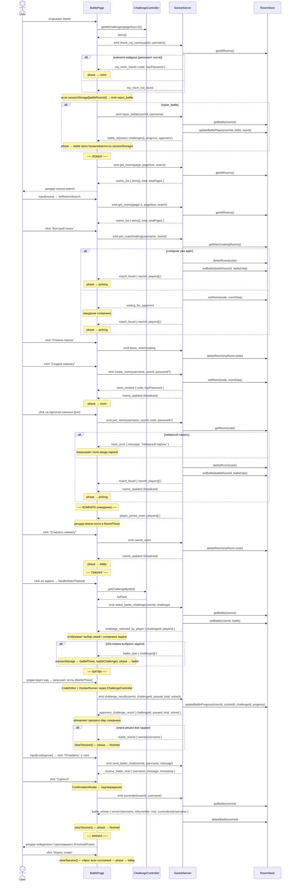

# Диаграмма последовательности — Battle Page

```mermaid
sequenceDiagram
    actor User
    participant Page as BattlePage
    participant CC as ChallengeController
    participant Socket as SocketServer
    participant RS as RoomStore

    User->>Page: открывает /battle
    Page->>CC: getAllChallenges(pageSize=20)
    CC-->>Page: items[]
    Page->>Socket: emit check_my_room(userId, username)
    Socket->>RS: getAllRooms()
    alt комната найдена (реконнект хоста)
        Socket-->>Page: my_room_found { code, hasPassword }
        Note over Page: phase → room
    else
        Socket-->>Page: my_room_not_found
    end
    Note over Page: если sessionStorage[battleRoomId] → emit rejoin_battle

    alt rejoin_battle
        Page->>Socket: emit rejoin_battle(roomId, username)
        Socket->>RS: getBattle(roomId)
        Socket->>RS: updateBattlePlayer(roomId, oldId, newId)
        Socket-->>Page: battle_rejoined { challenges[], progress, opponent }
        Note over Page: phase → battle (восстанавливается из sessionStorage)
    end

    Note over Page: ── ЛОББИ ──

    Page->>Socket: emit get_rooms(page, pageSize, search)
    Socket->>RS: getAllRooms()
    Socket-->>Page: rooms_list { items[], total, totalPages }
    Page-->>User: рендер списка комнат

    User->>Page: input[поиск] → setRoomsSearch
    Page->>Socket: emit get_rooms(page=1, pageSize, search)
    Socket->>RS: getAllRooms()
    Socket-->>Page: rooms_list { items[], total, totalPages }

    User->>Page: click "Быстрый поиск"
    Page->>Socket: emit join_matchmaking(username, userId)
    Socket->>RS: getMatchmakingRooms()
    alt соперник уже ждёт
        Socket->>RS: deleteRoom(code)
        Socket->>RS: setBattle(battleRoomId, battleData)
        Socket-->>Page: match_found { roomId, players[] }
        Note over Page: phase → picking
    else
        Socket->>RS: setRoom(code, roomData)
        Socket-->>Page: waiting_for_opponent
        Note over Page: ожидание соперника
        Socket-->>Page: match_found { roomId, players[] }
        Note over Page: phase → picking
    end

    User->>Page: click "Отмена поиска"
    Page->>Socket: emit leave_matchmaking
    Socket->>RS: deleteRoom(myRoom.code)

    User->>Page: click "Создать комнату"
    Page->>Socket: emit create_room(username, userId, password?)
    Socket->>RS: setRoom(code, roomData)
    Socket-->>Page: room_created { code, hasPassword }
    Socket-->>Page: rooms_updated (broadcast)
    Note over Page: phase → room

    User->>Page: click на карточке комнаты (join)
    Page->>Socket: emit join_room(username, userId, code, password?)
    Socket->>RS: getRoom(code)
    alt неверный пароль
        Socket-->>Page: room_error { message: "Неверный пароль" }
        Note over Page: показывает поле ввода пароля
    else
        Socket->>RS: deleteRoom(code)
        Socket->>RS: setBattle(battleRoomId, battleData)
        Socket-->>Page: match_found { roomId, players[] }
        Socket-->>Page: rooms_updated (broadcast)
        Note over Page: phase → picking
    end

    Note over Page: ── КОМНАТА (ожидание) ──

    Socket-->>Page: player_joined_room { players[] }
    Note over Page: рендер имени гостя в RoomPhase

    User->>Page: click "Отменить комнату"
    Page->>Socket: emit cancel_room
    Socket->>RS: deleteRoom(myRoom.code)
    Socket-->>Page: rooms_updated (broadcast)
    Note over Page: phase → lobby

    Note over Page: ── ПИКИНГ ──

    User->>Page: click на задаче → handleSelectTask(id)
    Page->>CC: getChallengeById(id)
    CC-->>Page: fullTask
    Page->>Socket: emit select_battle_challenge(roomId, challenge)
    Socket->>RS: getBattle(roomId)
    Socket->>RS: setBattle(roomId, battle)
    Socket-->>Page: challenge_selected_by_player { challengeId, playerId }
    Note over Page: отображает выбор своей / соперника задачи
    alt оба игрока выбрали задачи
        Socket-->>Page: battle_start { challenges[] }
        Note over Page: sessionStorage ← battlePhase, battleChallenges, phase → battle
    end

    Note over Page: ── БИТВА ──

    User->>Page: редактирует код → запускает тесты (BattlePhase)
    Note over Page: CodeEditor + DockerRunner через ChallengeController
    Page->>Socket: emit challenge_result(roomId, challengeId, passed, total, solved)
    Socket->>RS: updateBattleProgress(roomId, socketId, challengeId, progress)
    Socket-->>Page: opponent_challenge_result { challengeId, passed, total, solved }
    Note over Page: обновляет прогресс-бар соперника
    alt игрок решил все задачи
        Socket-->>Page: battle_winner { winnerUsername }
        Note over Page: clearSession() — phase → finished
    end

    User->>Page: input[сообщение] → click "Отправить" в чате
    Page->>Socket: emit send_battle_chat(roomId, username, message)
    Socket-->>Page: receive_battle_chat { username, message, timestamp }

    User->>Page: click "Сдаться"
    Note over Page: ConfirmationModal → подтверждение
    Page->>Socket: emit surrender(roomId, username)
    Socket->>RS: getBattle(roomId)
    Socket-->>Page: battle_winner { winnerUsername, isSurrender: true, surrenderedUsername }
    Socket->>RS: deleteBattle(roomId)
    Note over Page: clearSession() — phase → finished

    Note over Page: ── ФИНАЛ ──

    Page-->>User: рендер победителя / проигравшего (FinishedPhase)

    User->>Page: click "Играть снова"
    Note over Page: clearSession() — сброс всех состояний — phase → lobby
```
