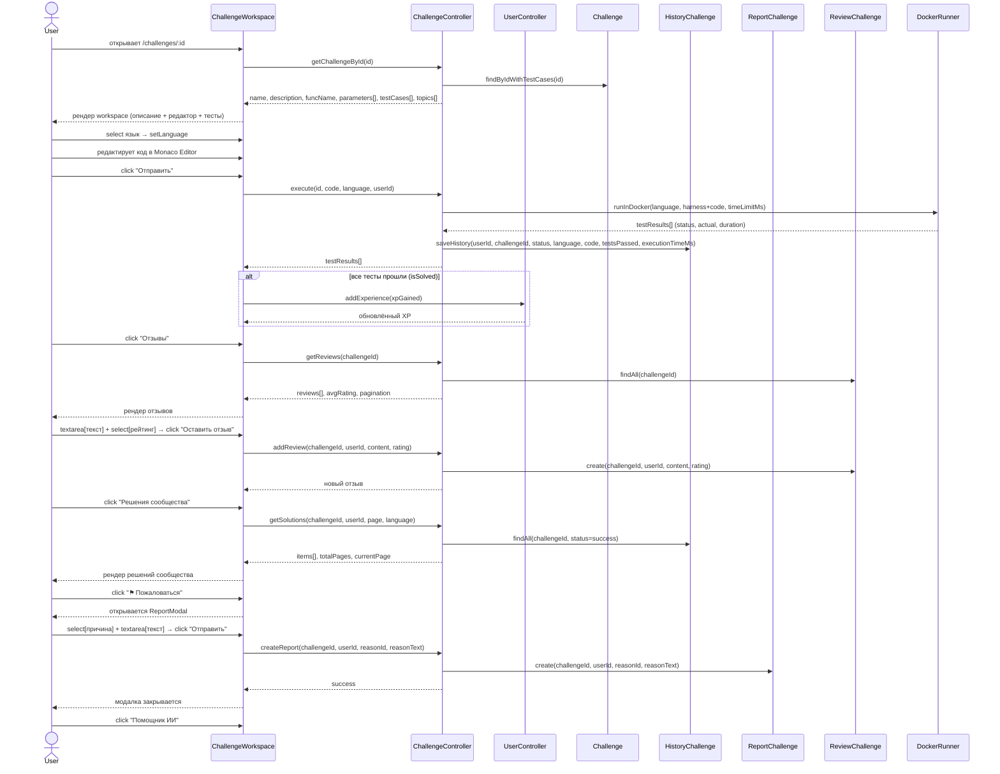

# Диаграмма последовательности — Challenge Page (Workspace)

```mermaid
sequenceDiagram
    actor User
    participant Page as ChallengeWorkspace
    participant CC as ChallengeController
    participant UC as UserController
    participant Challenge
    participant HC as HistoryChallenge
    participant RC as ReportChallenge
    participant RV as ReviewChallenge
    participant Docker as DockerRunner

    User->>Page: открывает /challenges/:id

    Page->>CC: getChallengeById(id)
    CC->>Challenge: findByIdWithTestCases(id)
    CC-->>Page: name, description, funcName, parameters[], testCases[], topics[]

    Page-->>User: рендер workspace (описание + редактор + тесты)

    User->>Page: select язык → setLanguage

    User->>Page: редактирует код в Monaco Editor

    User->>Page: click "Отправить"
    Page->>CC: execute(id, code, language, userId)
    CC->>Docker: runInDocker(language, harness+code, timeLimitMs)
    Docker-->>CC: testResults[] (status, actual, duration)
    CC->>HC: saveHistory(userId, challengeId, status, language, code, testsPassed, executionTimeMs)
    CC-->>Page: testResults[]

    alt все тесты прошли (isSolved)
        Page->>UC: addExperience(xpGained)
        UC-->>Page: обновлённый XP
    end

    User->>Page: click "Отзывы"
    Page->>CC: getReviews(challengeId)
    CC->>RV: findAll(challengeId)
    CC-->>Page: reviews[], avgRating, pagination
    Page-->>User: рендер отзывов

    User->>Page: textarea[текст] + select[рейтинг] → click "Оставить отзыв"
    Page->>CC: addReview(challengeId, userId, content, rating)
    CC->>RV: create(challengeId, userId, content, rating)
    CC-->>Page: новый отзыв

    User->>Page: click "Решения сообщества"
    Page->>CC: getSolutions(challengeId, userId, page, language)
    CC->>HC: findAll(challengeId, status=success)
    CC-->>Page: items[], totalPages, currentPage
    Page-->>User: рендер решений сообщества

    User->>Page: click "⚑ Пожаловаться"
    Page-->>User: открывается ReportModal

    User->>Page: select[причина] + textarea[текст] → click "Отправить"
    Page->>CC: createReport(challengeId, userId, reasonId, reasonText)
    CC->>RC: create(challengeId, userId, reasonId, reasonText)
    CC-->>Page: success
    Page-->>User: модалка закрывается

    User->>Page: click "Помощник ИИ"
```
