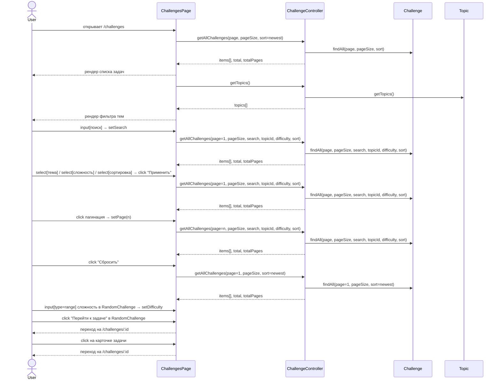

# Диаграмма последовательности — Challenges Page

```mermaid
sequenceDiagram
    actor User
    participant Page as ChallengesPage
    participant CC as ChallengeController
    participant Challenge
    participant Topic

    User->>Page: открывает /challenges

    Page->>CC: getAllChallenges(page, pageSize, sort=newest)
    CC->>Challenge: findAll(page, pageSize, sort)
    CC-->>Page: items[], total, totalPages
    Page-->>User: рендер списка задач

    Page->>CC: getTopics()
    CC->>Topic: getTopics()
    CC-->>Page: topics[]
    Page-->>User: рендер фильтра тем

    User->>Page: input[поиск] → setSearch
    Page->>CC: getAllChallenges(page=1, pageSize, search, topicId, difficulty, sort)
    CC->>Challenge: findAll(page, pageSize, search, topicId, difficulty, sort)
    CC-->>Page: items[], total, totalPages

    User->>Page: select[тема] / select[сложность] / select[сортировка] → click "Применить"
    Page->>CC: getAllChallenges(page=1, pageSize, search, topicId, difficulty, sort)
    CC->>Challenge: findAll(page, pageSize, search, topicId, difficulty, sort)
    CC-->>Page: items[], total, totalPages

    User->>Page: click пагинация → setPage(n)
    Page->>CC: getAllChallenges(page=n, pageSize, search, topicId, difficulty, sort)
    CC->>Challenge: findAll(page, pageSize, search, topicId, difficulty, sort)
    CC-->>Page: items[], total, totalPages

    User->>Page: click "Сбросить"
    Page->>CC: getAllChallenges(page=1, pageSize, sort=newest)
    CC->>Challenge: findAll(page=1, pageSize, sort=newest)
    CC-->>Page: items[], total, totalPages

    User->>Page: input[type=range] сложность в RandomChallenge → setDifficulty

    User->>Page: click "Перейти к задаче" в RandomChallenge
    Page-->>User: переход на /challenges/:id

    User->>Page: click на карточке задачи
    Page-->>User: переход на /challenges/:id
```
