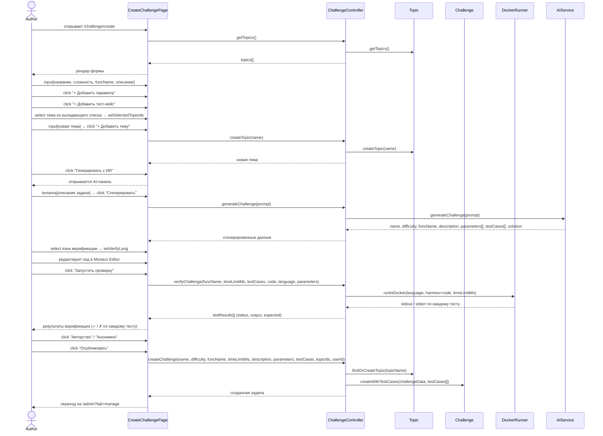

# Диаграмма последовательности — Create Challenge Page

```mermaid
sequenceDiagram
    actor Author
    participant Page as CreateChallengePage
    participant CC as ChallengeController
    participant Topic
    participant Challenge
    participant Docker as DockerRunner
    participant AI as AIService

    Author->>Page: открывает /challenge/create
    Page->>CC: getTopics()
    CC->>Topic: getTopics()
    CC-->>Page: topics[]
    Page-->>Author: рендер формы

    Author->>Page: input[название, сложность, funcName, описание]
    Author->>Page: click "+ Добавить параметр"
    Author->>Page: click "+ Добавить тест-кейс"

    Author->>Page: select тема из выпадающего списка → setSelectedTopicIds

    Author->>Page: input[новая тема] → click "+ Добавить тему"
    Page->>CC: createTopic(name)
    CC->>Topic: createTopic(name)
    CC-->>Page: новая тема

    Author->>Page: click "Генерировать с ИИ"
    Page-->>Author: открывается AI-панель

    Author->>Page: textarea[описание задачи] → click "Сгенерировать"
    Page->>CC: generateChallenge(prompt)
    CC->>AI: generateChallenge(prompt)
    AI-->>CC: name, difficulty, funcName, description, parameters[], testCases[], solution
    CC-->>Page: сгенерированные данные

    Author->>Page: select язык верификации → setVerifyLang

    Author->>Page: редактирует код в Monaco Editor

    Author->>Page: click "Запустить проверку"
    Page->>CC: verifyChallenge(funcName, timeLimitMs, testCases, code, language, parameters)
    CC->>Docker: runInDocker(language, harness+code, timeLimitMs)
    Docker-->>CC: stdout / stderr по каждому тесту
    CC-->>Page: testResults[] (status, output, expected)
    Page-->>Author: результаты верификации (✓ / ✗ по каждому тесту)

    Author->>Page: click "Авторство" / "Анонимно"

    Author->>Page: click "Опубликовать"
    Page->>CC: createChallenge(name, difficulty, funcName, timeLimitMs, description, parameters, testCases, topicIds, userId)
    CC->>Topic: findOrCreateTopic(topicName)
    CC->>Challenge: createWithTestCases(challengeData, testCases[])
    CC-->>Page: созданная задача
    Page-->>Author: переход на /admin?tab=manage
```
