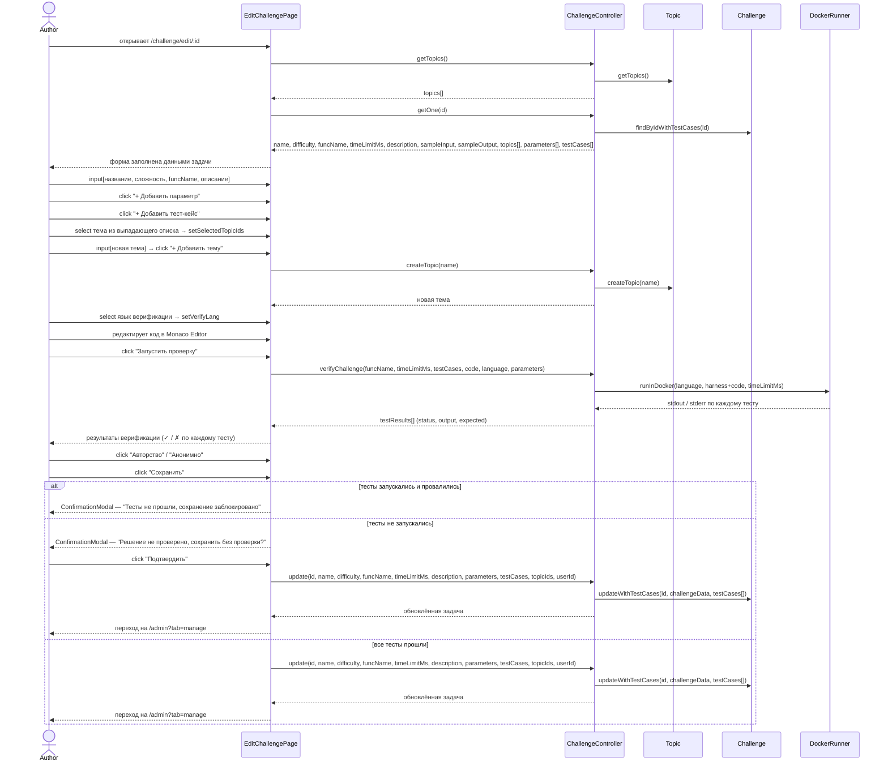

# Диаграмма последовательности — Edit Challenge Page

```mermaid
sequenceDiagram
    actor Author
    participant Page as EditChallengePage
    participant CC as ChallengeController
    participant Topic
    participant Challenge
    participant Docker as DockerRunner

    Author->>Page: открывает /challenge/edit/:id

    Page->>CC: getTopics()
    CC->>Topic: getTopics()
    CC-->>Page: topics[]

    Page->>CC: getOne(id)
    CC->>Challenge: findByIdWithTestCases(id)
    CC-->>Page: name, difficulty, funcName, timeLimitMs, description, sampleInput, sampleOutput, topics[], parameters[], testCases[]
    Page-->>Author: форма заполнена данными задачи

    Author->>Page: input[название, сложность, funcName, описание]
    Author->>Page: click "+ Добавить параметр"
    Author->>Page: click "+ Добавить тест-кейс"

    Author->>Page: select тема из выпадающего списка → setSelectedTopicIds

    Author->>Page: input[новая тема] → click "+ Добавить тему"
    Page->>CC: createTopic(name)
    CC->>Topic: createTopic(name)
    CC-->>Page: новая тема

    Author->>Page: select язык верификации → setVerifyLang

    Author->>Page: редактирует код в Monaco Editor

    Author->>Page: click "Запустить проверку"
    Page->>CC: verifyChallenge(funcName, timeLimitMs, testCases, code, language, parameters)
    CC->>Docker: runInDocker(language, harness+code, timeLimitMs)
    Docker-->>CC: stdout / stderr по каждому тесту
    CC-->>Page: testResults[] (status, output, expected)
    Page-->>Author: результаты верификации (✓ / ✗ по каждому тесту)

    Author->>Page: click "Авторство" / "Анонимно"

    Author->>Page: click "Сохранить"

    alt тесты запускались и провалились
        Page-->>Author: ConfirmationModal — "Тесты не прошли, сохранение заблокировано"
    else тесты не запускались
        Page-->>Author: ConfirmationModal — "Решение не проверено, сохранить без проверки?"
        Author->>Page: click "Подтвердить"
        Page->>CC: update(id, name, difficulty, funcName, timeLimitMs, description, parameters, testCases, topicIds, userId)
        CC->>Challenge: updateWithTestCases(id, challengeData, testCases[])
        CC-->>Page: обновлённая задача
        Page-->>Author: переход на /admin?tab=manage
    else все тесты прошли
        Page->>CC: update(id, name, difficulty, funcName, timeLimitMs, description, parameters, testCases, topicIds, userId)
        CC->>Challenge: updateWithTestCases(id, challengeData, testCases[])
        CC-->>Page: обновлённая задача
        Page-->>Author: переход на /admin?tab=manage
    end
```
