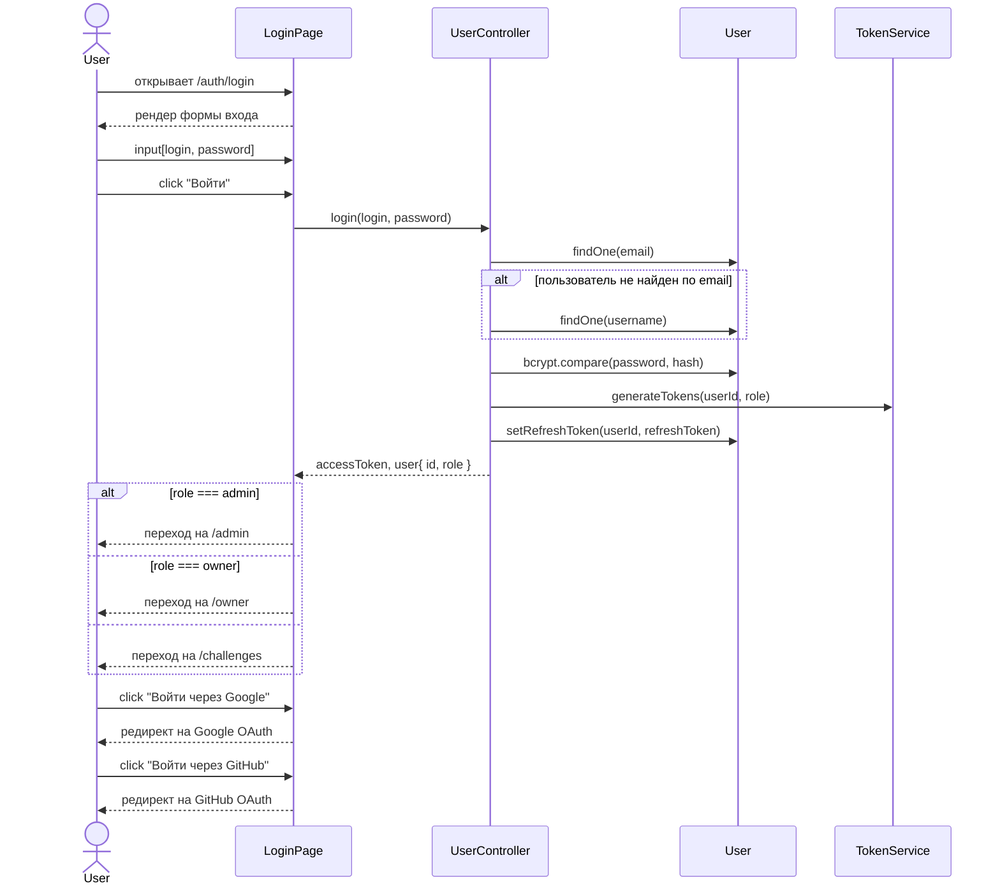

# Диаграмма последовательности — Login Page

```mermaid
sequenceDiagram
    actor User
    participant Page as LoginPage
    participant UC as UserController
    participant UserModel as User
    participant Token as TokenService

    User->>Page: открывает /auth/login
    Page-->>User: рендер формы входа

    User->>Page: input[login, password]

    User->>Page: click "Войти"
    Page->>UC: login(login, password)
    UC->>UserModel: findOne(email)
    alt пользователь не найден по email
        UC->>UserModel: findOne(username)
    end
    UC->>UserModel: bcrypt.compare(password, hash)
    UC->>Token: generateTokens(userId, role)
    UC->>UserModel: setRefreshToken(userId, refreshToken)
    UC-->>Page: accessToken, user{ id, role }

    alt role === admin
        Page-->>User: переход на /admin
    else role === owner
        Page-->>User: переход на /owner
    else
        Page-->>User: переход на /challenges
    end

    User->>Page: click "Войти через Google"
    Page-->>User: редирект на Google OAuth

    User->>Page: click "Войти через GitHub"
    Page-->>User: редирект на GitHub OAuth
```
