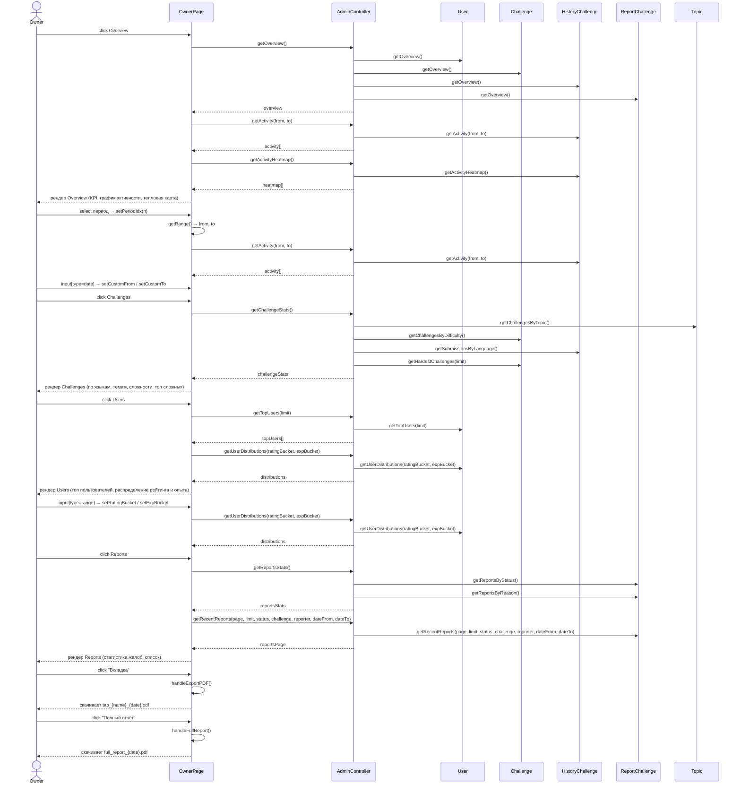

# Диаграмма последовательности — Owner Page

```mermaid
sequenceDiagram
    actor Owner
    participant Page as OwnerPage
    participant AC as AdminController
    participant User
    participant Challenge
    participant HC as HistoryChallenge
    participant RC as ReportChallenge
    participant Topic

    Owner->>Page: click Overview

    Page->>AC: getOverview()
    AC->>User: getOverview()
    AC->>Challenge: getOverview()
    AC->>HC: getOverview()
    AC->>RC: getOverview()
    AC-->>Page: overview

    Page->>AC: getActivity(from, to)
    AC->>HC: getActivity(from, to)
    AC-->>Page: activity[]

    Page->>AC: getActivityHeatmap()
    AC->>HC: getActivityHeatmap()
    AC-->>Page: heatmap[]

    Page-->>Owner: рендер Overview (KPI, график активности, тепловая карта)

    Owner->>Page: select период → setPeriodIdx(n)
    Page->>Page: getRange() → from, to
    Page->>AC: getActivity(from, to)
    AC->>HC: getActivity(from, to)
    AC-->>Page: activity[]

    Owner->>Page: input[type=date] → setCustomFrom / setCustomTo

    Owner->>Page: click Challenges

    Page->>AC: getChallengeStats()
    AC->>Topic: getChallengesByTopic()
    AC->>Challenge: getChallengesByDifficulty()
    AC->>HC: getSubmissionsByLanguage()
    AC->>Challenge: getHardestChallenges(limit)
    AC-->>Page: challengeStats

    Page-->>Owner: рендер Challenges (по языкам, темам, сложности, топ сложных)

    Owner->>Page: click Users

    Page->>AC: getTopUsers(limit)
    AC->>User: getTopUsers(limit)
    AC-->>Page: topUsers[]

    Page->>AC: getUserDistributions(ratingBucket, expBucket)
    AC->>User: getUserDistributions(ratingBucket, expBucket)
    AC-->>Page: distributions

    Page-->>Owner: рендер Users (топ пользователей, распределение рейтинга и опыта)

    Owner->>Page: input[type=range] → setRatingBucket / setExpBucket
    Page->>AC: getUserDistributions(ratingBucket, expBucket)
    AC->>User: getUserDistributions(ratingBucket, expBucket)
    AC-->>Page: distributions

    Owner->>Page: click Reports

    Page->>AC: getReportsStats()
    AC->>RC: getReportsByStatus()
    AC->>RC: getReportsByReason()
    AC-->>Page: reportsStats

    Page->>AC: getRecentReports(page, limit, status, challenge, reporter, dateFrom, dateTo)
    AC->>RC: getRecentReports(page, limit, status, challenge, reporter, dateFrom, dateTo)
    AC-->>Page: reportsPage

    Page-->>Owner: рендер Reports (статистика жалоб, список)

    Owner->>Page: click "Вкладка"
    Page->>Page: handleExportPDF()
    Page-->>Owner: скачивает tab_{name}_{date}.pdf

    Owner->>Page: click "Полный отчёт"
    Page->>Page: handleFullReport()
    Page-->>Owner: скачивает full_report_{date}.pdf
```
