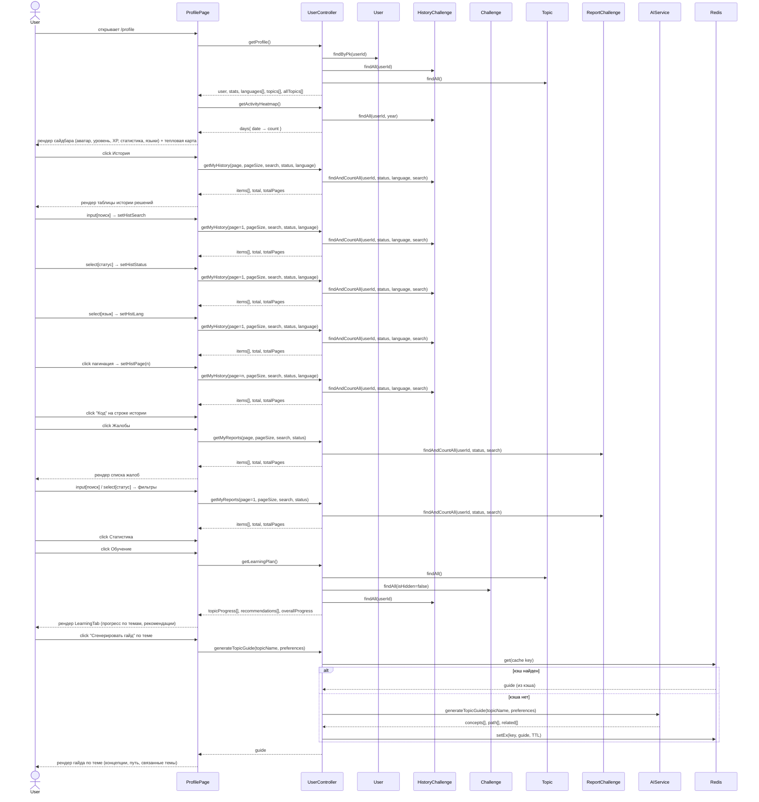

# Диаграмма последовательности — Profile Page

```mermaid
sequenceDiagram
    actor User
    participant Page as ProfilePage
    participant UC as UserController
    participant UserModel as User
    participant HC as HistoryChallenge
    participant Challenge
    participant Topic
    participant RC as ReportChallenge
    participant AI as AIService
    participant Redis

    User->>Page: открывает /profile

    Page->>UC: getProfile()
    UC->>UserModel: findByPk(userId)
    UC->>HC: findAll(userId)
    UC->>Topic: findAll()
    UC-->>Page: user, stats, languages[], topics[], allTopics[]

    Page->>UC: getActivityHeatmap()
    UC->>HC: findAll(userId, year)
    UC-->>Page: days{ date → count }

    Page-->>User: рендер сайдбара (аватар, уровень, XP, статистика, языки) + тепловая карта

    User->>Page: click История

    Page->>UC: getMyHistory(page, pageSize, search, status, language)
    UC->>HC: findAndCountAll(userId, status, language, search)
    UC-->>Page: items[], total, totalPages
    Page-->>User: рендер таблицы истории решений

    User->>Page: input[поиск] → setHistSearch
    Page->>UC: getMyHistory(page=1, pageSize, search, status, language)
    UC->>HC: findAndCountAll(userId, status, language, search)
    UC-->>Page: items[], total, totalPages

    User->>Page: select[статус] → setHistStatus
    Page->>UC: getMyHistory(page=1, pageSize, search, status, language)
    UC->>HC: findAndCountAll(userId, status, language, search)
    UC-->>Page: items[], total, totalPages

    User->>Page: select[язык] → setHistLang
    Page->>UC: getMyHistory(page=1, pageSize, search, status, language)
    UC->>HC: findAndCountAll(userId, status, language, search)
    UC-->>Page: items[], total, totalPages

    User->>Page: click пагинация → setHistPage(n)
    Page->>UC: getMyHistory(page=n, pageSize, search, status, language)
    UC->>HC: findAndCountAll(userId, status, language, search)
    UC-->>Page: items[], total, totalPages

    User->>Page: click "Код" на строке истории

    User->>Page: click Жалобы

    Page->>UC: getMyReports(page, pageSize, search, status)
    UC->>RC: findAndCountAll(userId, status, search)
    UC-->>Page: items[], total, totalPages
    Page-->>User: рендер списка жалоб

    User->>Page: input[поиск] / select[статус] → фильтры
    Page->>UC: getMyReports(page=1, pageSize, search, status)
    UC->>RC: findAndCountAll(userId, status, search)
    UC-->>Page: items[], total, totalPages

    User->>Page: click Статистика

    User->>Page: click Обучение

    Page->>UC: getLearningPlan()
    UC->>Topic: findAll()
    UC->>Challenge: findAll(isHidden=false)
    UC->>HC: findAll(userId)
    UC-->>Page: topicProgress[], recommendations[], overallProgress
    Page-->>User: рендер LearningTab (прогресс по темам, рекомендации)

    User->>Page: click "Сгенерировать гайд" по теме
    Page->>UC: generateTopicGuide(topicName, preferences)
    UC->>Redis: get(cache key)
    alt кэш найден
        Redis-->>UC: guide (из кэша)
    else кэша нет
        UC->>AI: generateTopicGuide(topicName, preferences)
        AI-->>UC: concepts[], path[], related[]
        UC->>Redis: setEx(key, guide, TTL)
    end
    UC-->>Page: guide
    Page-->>User: рендер гайда по теме (концепции, путь, связанные темы)
```
