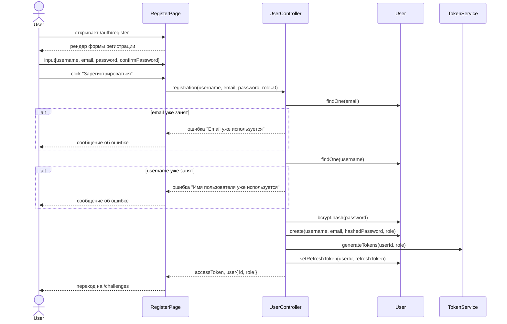

# Диаграмма последовательности — Register Page

```mermaid
sequenceDiagram
    actor User
    participant Page as RegisterPage
    participant UC as UserController
    participant UserModel as User
    participant Token as TokenService

    User->>Page: открывает /auth/register
    Page-->>User: рендер формы регистрации

    User->>Page: input[username, email, password, confirmPassword]

    User->>Page: click "Зарегистрироваться"
    Page->>UC: registration(username, email, password, role=0)
    UC->>UserModel: findOne(email)
    alt email уже занят
        UC-->>Page: ошибка "Email уже используется"
        Page-->>User: сообщение об ошибке
    end
    UC->>UserModel: findOne(username)
    alt username уже занят
        UC-->>Page: ошибка "Имя пользователя уже используется"
        Page-->>User: сообщение об ошибке
    end
    UC->>UserModel: bcrypt.hash(password)
    UC->>UserModel: create(username, email, hashedPassword, role)
    UC->>Token: generateTokens(userId, role)
    UC->>UserModel: setRefreshToken(userId, refreshToken)
    UC-->>Page: accessToken, user{ id, role }
    Page-->>User: переход на /challenges
```
